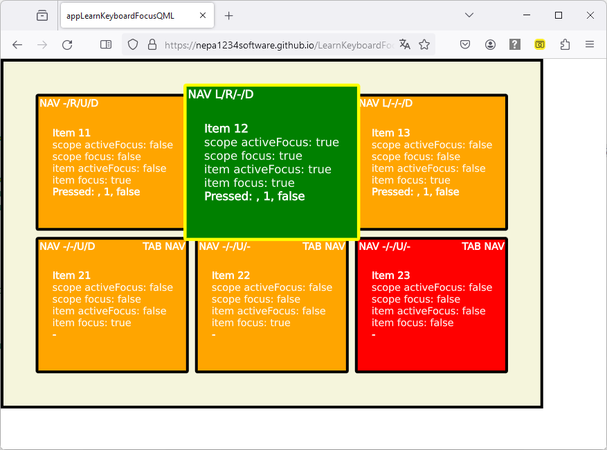

# LearnKeyboardFocusQML-WebAssembly
This is a small project for learning QML keyboard focus and navigation. States and transitions are used for a bit of fun. 
WebAssembly (WASM) is a drop-in compiler for generating web based application. The build output files are hosted using this repo using github pages to host the statis html page. Now anyone can play around with the application without needing to build it.
The application is build using two rows or QML custom items. The first row sets up KeyNavigation attached property (which in turn provide the navigation back to this). The second row uses the build in tab navigation property of standard Control bases Items. The last Item is not configured to receive focus, but implements the FocusScope, thus has its own "special" albeit surprising behaviour...

## Play Online

URL: https://nepa1234software.github.io/LearnKeyboardFocusQML-WebAssembly/appLearnKeyboardFocusQML.html

## Code

Repo URL: https://github.com/NePa1234Software/LearnKeyboardFocusQML

## Licensing

See the license file and License Folder for details
- The app is build using the Qt Framework opensource version (https://www.qt.io/licensing/)
- WebAssembly build powered by emscription SDK (https://emscripten.org/docs/introducing_emscripten/emscripten_license.html)

## Screenshots

